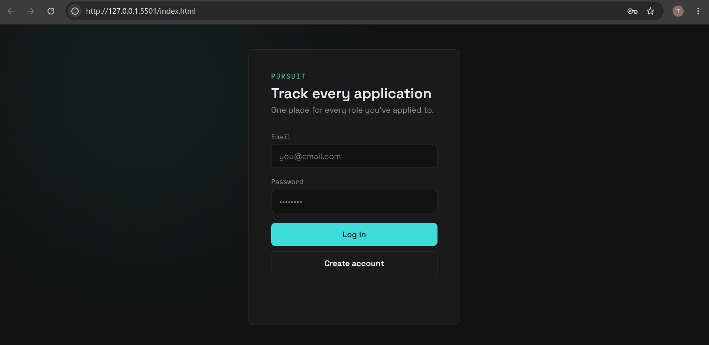
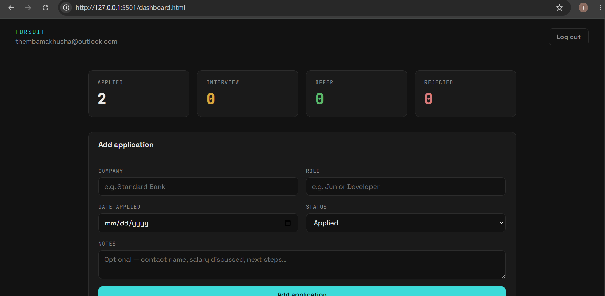

# Pursuit

A job application tracker built to help me stay organized while applying for software developer roles. Track every application, its status, and notes — all in one place.

## Live Demo

## Screenshots

### Login

### Dashboard

## Features

- Email/password authentication (signup, login, logout)
- Add, edit, and delete job applications
- Track status: Applied, Interview, Offer, Rejected
- Search by company or role, filter by status
- Live stats dashboard (totals per status)
- Row Level Security — each user only sees their own data
- Fully responsive (mobile and desktop)

## Tech Stack

- **Frontend:** HTML, CSS, vanilla JavaScript
- **Backend / Database:** Supabase (PostgreSQL, Auth, Row Level Security)

## What I Learned

This was my first project working directly with a relational database, authentication, and Row Level Security. Building it from scratch (rather than using a template) taught me:

- How async/await works when calling external APIs
- How Postgres permissions work at two levels: table grants and RLS policies
- How to structure client-side filtering and state without a framework
